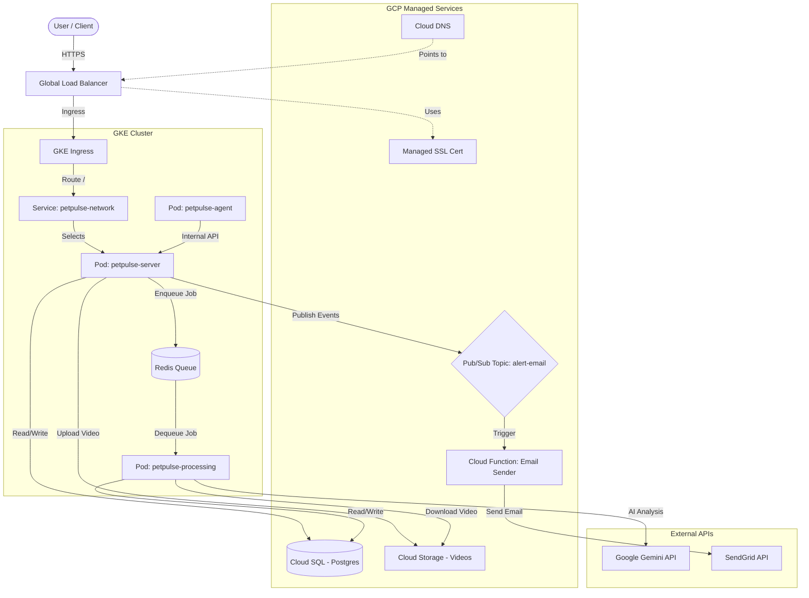

# PetPulse Infrastructure

This repository contains the Infrastructure as Code (IaC) and deployment scripts for the PetPulse platform on Google Cloud Platform (GCP). It utilizes Terraform for provisioning cloud resources and Kubernetes (GKE) for container orchestration.

## 🏗️ Architecture Overview

The PetPulse platform is built on a microservices-inspired architecture running on GKE, leveraging managed GCP services for persistence, messaging, and storage.



### Key Components

#### 1. Compute & Orchestration (GKE)
- **GKE Cluster**: A zonal cluster containing the application workload.
- **Node Pool**: Autoscaling node pool (1-3 nodes) hosting the pods.
- **Workloads**:
    - `petpulse-server`: Main API server (Node.js/NestJS).
    - `petpulse-processing`: Background worker for processing tasks.
    - `petpulse-agent`: Internal agent service.
- **Ingress**: GKE Ingress controller managing external access via an HTTP(S) Load Balancer.

#### 2. Data & Storage
- **Cloud SQL (PostgreSQL)**: Primary relational database. Accessed via Private Service Access (Private IP) from the GKE cluster.
- **Cloud Storage (GCS)**: Stores video evidence uploads (`petpulse-videos-{env}`). Configured with CORS for direct browser access/uploads if needed.
- **Redis (Optional)**: Referenced in configuration, likely for caching or queues (deployed within K8s).

#### 3. Networking & Security
- **VPC**: Custom VPC network with separate subnets for pods and services.
- **Private Service Access**: Peering connection for private communication with Cloud SQL.
- **Cloud DNS & SSL**: Managed DNS zone and Google-managed SSL certificates for secure HTTPS access.
- **Secret Manager**: Securely stores sensitive credentials (DB passwords) and syncs them to K8s Secrets.

#### 4. Event & Serverless
- **Pub/Sub**: Decoupled messaging system. The `server` publishes alert events.
- **Cloud Functions (Gen 2)**: `email-sender` function triggered by Pub/Sub messages to send emails via SendGrid. This offloads email delivery from the main application flow.

## 📂 Directory Structure

| Directory | Description |
|-----------|-------------|
| `terraform/` | Terraform configurations for provisioning all GCP resources (GKE, SQL, VPC, etc.). |
| `k8s/` | Kubernetes manifests (Deployment, Service, Ingress) for deploying the application. |
| `script/` | Shell scripts for deployment automation. |

## 🚀 Deployment Guide

### Prerequisites
- **Terraform** >= 1.0
- **Google Cloud SDK** (`gcloud`) installed and authenticated.
- **kubectl** installed (`gcloud components install kubectl`).
- **Access**: GCP Project `clestiq-petpulse` owner/editor role.

### Step 1: Provision Infrastructure (Terraform)

This step creates the VPC, GKE cluster, Database, and other cloud resources.

**1. Navigate to the terraform directory:**
```bash
cd terraform
```

**2. Initialize Terraform:**
```bash
terraform init
```

**3. Deploy environment (Preview or Production):**
You can use the helper script in the root or run terraform directly.

**Using `deploy.sh` (Recommended):**
```bash
# Deploys Terraform resources
./script/deploy.sh preview
# OR
./script/deploy.sh production
```

> **Note**: This script handles building the Cloud Function zip file from the `PetPulse-Serverless` directory before applying Terraform.

### Step 2: Deploy Workloads (Kubernetes)

Once the infrastructure is ready, deploy the application containers to GKE.

**Using `deploy-k8s.sh`:**
```bash
# Deploys K8s manifests
./script/deploy-k8s.sh preview
# OR
./script/deploy-k8s.sh production
```

**What this script does:**
1. Reads Terraform outputs to get dynamic values (DB IP, Cluster Name, etc.).
2. Authenticates `kubectl` to the GKE cluster.
3. Configures IAM bindings for Workload Identity/Service Accounts.
4. Creates/Updates K8s Secrets (DB params, API Keys).
5. Applies all manifests in `k8s/`.
6. Rolls out restarts to deployments to ensure config updates take effect.

## 🛠️ Configuration

### Terraform Variables (`terraform.tfvars`)
- `project_id`: GCP Project ID.
- `region` / `zone`: Deployment location.
- `domain_name`: Domain for the application.
- `sendgrid_api_key`: API Key for email service.

### Kubernetes Config (`k8s/`)
- **ConfigMaps/Secrets**: Generated dynamically by `deploy-k8s.sh` based on Terraform outputs.
- **Ingress**: Configured to use the static IP and managed certificate provisioned by Terraform.